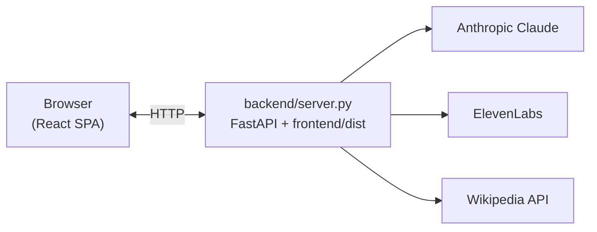
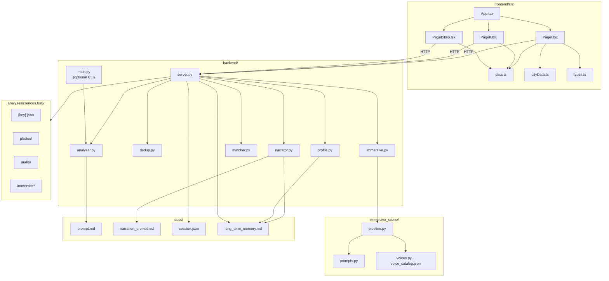
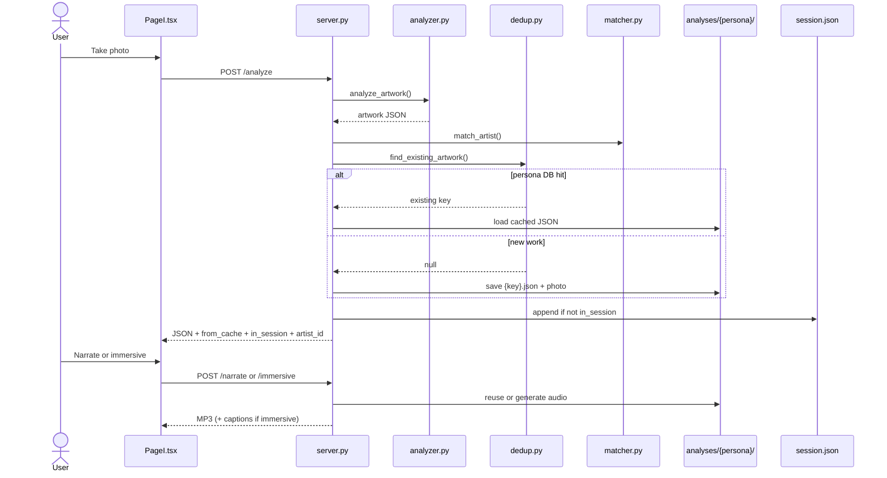
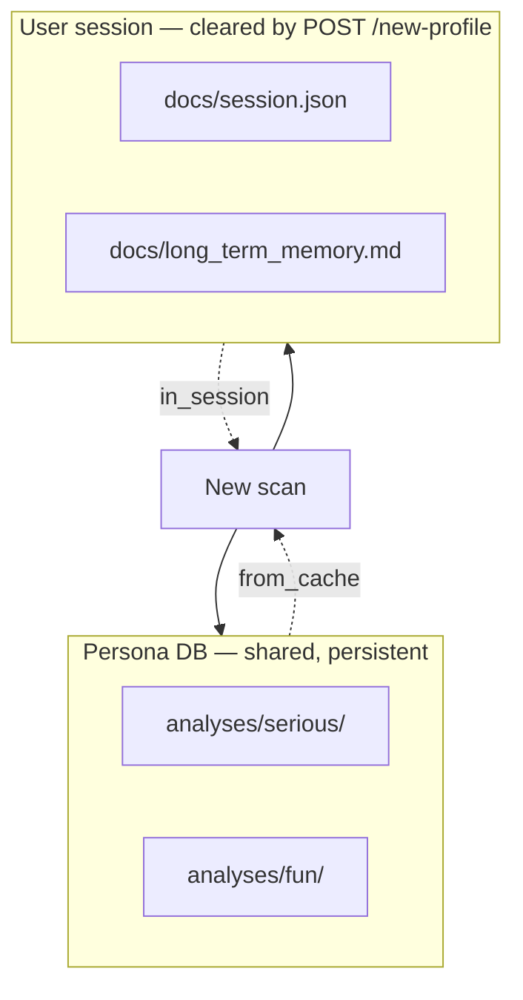

# Musées — AI museum guide

Mobile-first web app for museum visits. A visitor photographs an artwork; **Claude** analyzes it and produces structured metadata. The app then offers two audio experiences — a **personalized narration** or an **immersive scene** — via **ElevenLabs**, adapted to a visitor persona. Gamification tracks artist **quests** and builds a personal **library** of scanned works.

All generated text and audio is in **English**. JSON field names in the analysis schema are French (`titre_probable`, `artiste_probable`, …) — internal keys only.

---

## Features

- **Onboarding** — short questionnaire → visitor profile (demo: two personas, `serious` / `fun`, driven by tone choice)
- **City & museum journey** — pick a city, museum, era, or featured artist before scanning (`cityData.ts`: Paris, London, Amsterdam, Madrid, Florence, New York, Rome, …)
- **Artwork scan** — camera upload, client-side resize, Claude vision analysis
- **Semantic dedup** — Claude agent matches new scans to existing works (e.g. *Mona Lisa* = *La Joconde*)
- **Classic narration** — Claude writes the script, ElevenLabs speaks it (persona-aware)
- **Immersive scene** — multi-voice theatrical audio with ambient textures, music, SFX, and word-level captions (`immersive_scene/`)
- **Quests** — scan progress per artist at the Louvre, Orsay, and Pompidou (`PageII`, `data.ts`)
- **Library** — session artworks grouped by museum, detail modal, audio playback (`PageBiblio`)

---

## Stack

| Layer | Technology |
|-------|------------|
| Backend | Python 3.11+, FastAPI, Uvicorn |
| Frontend | React 19, Vite, TypeScript |
| Vision / text | Anthropic Claude (`analyzer`, `dedup`, `narrator`, immersive script) |
| Audio | ElevenLabs (TTS, multi-voice dialogue, music, SFX) |
| Images | OpenCV (resize, perceptual hash), Wikipedia API |
| Deps | [uv](https://docs.astral.sh/uv/) + `pyproject.toml` / `uv.lock` |

---

## Architecture

### System context



### Module map

Relationships between the main source files. Prompts live in `docs/`; runtime data in `analyses/` and `docs/session.json`.



### Scan flow



### Data model

Two decoupled tiers: a **shared persona cache** and a **per-visitor session**.



| Flag | Meaning |
|------|---------|
| `from_cache` | Artwork JSON (and audio) reused from the persona DB |
| `in_session` | User already scanned this work — quests/library skip it |

Quest progress uses **`in_session`**, not `from_cache`: cache hits still count as new discoveries for this visitor.

---

## Project layout

```
GENZ_MUSEUM/
├── backend/
│   ├── server.py          # FastAPI app, routes, static files
│   ├── analyzer.py        # Claude vision → artwork JSON
│   ├── dedup.py           # Claude dedup agent
│   ├── narrator.py        # Claude narration → ElevenLabs TTS
│   ├── immersive.py       # Bridge to immersive_scene
│   ├── matcher.py         # Artist name → museum/artist id
│   ├── profile.py         # Onboarding → persona
│   └── main.py            # Optional CLI: analyze a single image file
├── frontend/src/          # React UI (PageI · PageII · PageBiblio)
├── immersive_scene/       # Immersive audio pipeline
├── analyses/{serious,fun}/  # Persona DB (runtime, may be populated)
├── docs/                  # Prompts + session memory
├── pyproject.toml
└── uv.lock
```

---

## Prerequisites

| Requirement | Notes |
|-------------|-------|
| Python ≥ 3.11 | |
| [uv](https://docs.astral.sh/uv/) | recommended |
| Node.js | frontend build |
| **ffmpeg** | system binary, required for immersive audio |
| `.env` | API keys (see below) |

---

## Quick start

### 1. Clone and configure

```bash
git clone https://github.com/theaudaudiffret/GENZ_MUSEUM.git
cd GENZ_MUSEUM
```

Create `.env` at the repo root:

```env
ANTHROPIC_API_KEY=sk-ant-...
ELEVENLABS_API_KEY=sk_...
```

### 2. Install Python dependencies

```bash
uv sync
```

### 3. Build the frontend

The server serves `frontend/dist/` — rebuild after any UI change.

```bash
cd frontend
npm install
npm run build
cd ..
```

### 4. Run the server

```bash
uv run python -m backend.server
```

Uvicorn binds to **port 8000** (`0.0.0.0`) and prints a LAN URL for phone access on the same Wi‑Fi.

Without uv:

```bash
python -m venv .venv && source .venv/bin/activate
pip install -e .
python -m backend.server
```

### 5. (Optional) Analyze one image from the CLI

```bash
uv run python -m backend.main path/to/photo.jpg
```

### 6. (Optional) Sync ElevenLabs voices for immersive casting

```bash
uv run python -m immersive_scene.sync_voices
```

See [`immersive_scene/README.md`](immersive_scene/README.md).

---

## API routes

| Method | Route | Purpose |
|--------|-------|---------|
| `POST` | `/profile` | Save onboarding → persona |
| `POST` | `/new-profile` | Reset session (persona DB untouched) |
| `POST` | `/analyze` | Upload photo → artwork JSON |
| `POST` | `/narrate` | Cached or new narration MP3 |
| `POST` | `/immersive` | Cached or new immersive MP3 + captions |
| `GET` | `/library` | Session library |
| `GET` | `/artwork/{key}` | Full artwork JSON |
| `GET` | `/photos/{key}` | Artwork image |
| `GET` | `/audio/{key}` | Narration MP3 |
| `GET` | `/immersive-audio/{key}` | Immersive MP3 |

Static assets from `frontend/dist/` are served at `/`.

---

## Further reading

| Document | Contents |
|----------|----------|
| [`immersive_scene/README.md`](immersive_scene/README.md) | Immersive pipeline, voices, sound design |
| [`docs/prompt.md`](docs/prompt.md) | Vision analysis prompt |
| [`docs/narration_prompt.md`](docs/narration_prompt.md) | Narration prompt |
| [`CLAUDE.md`](CLAUDE.md) | Contributor / agent notes |

---

## Gotchas

- Session data survives server restarts; only `/new-profile` clears it.
- Each scan may trigger an extra Claude dedup call once the persona DB is non-empty.
- Wikipedia thumbnails use `httpx` with a `curl` fallback (upload.wikimedia.org blocks Python TLS).
- Narration and immersive are separate modes — the visitor chooses one per artwork.
