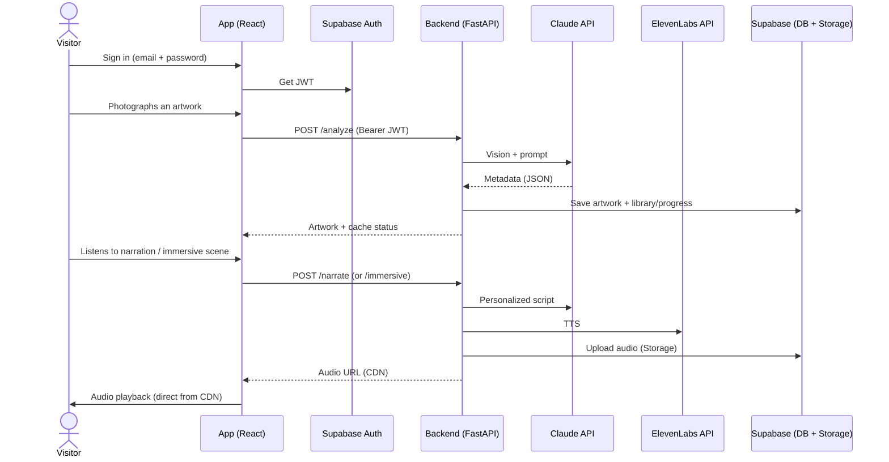
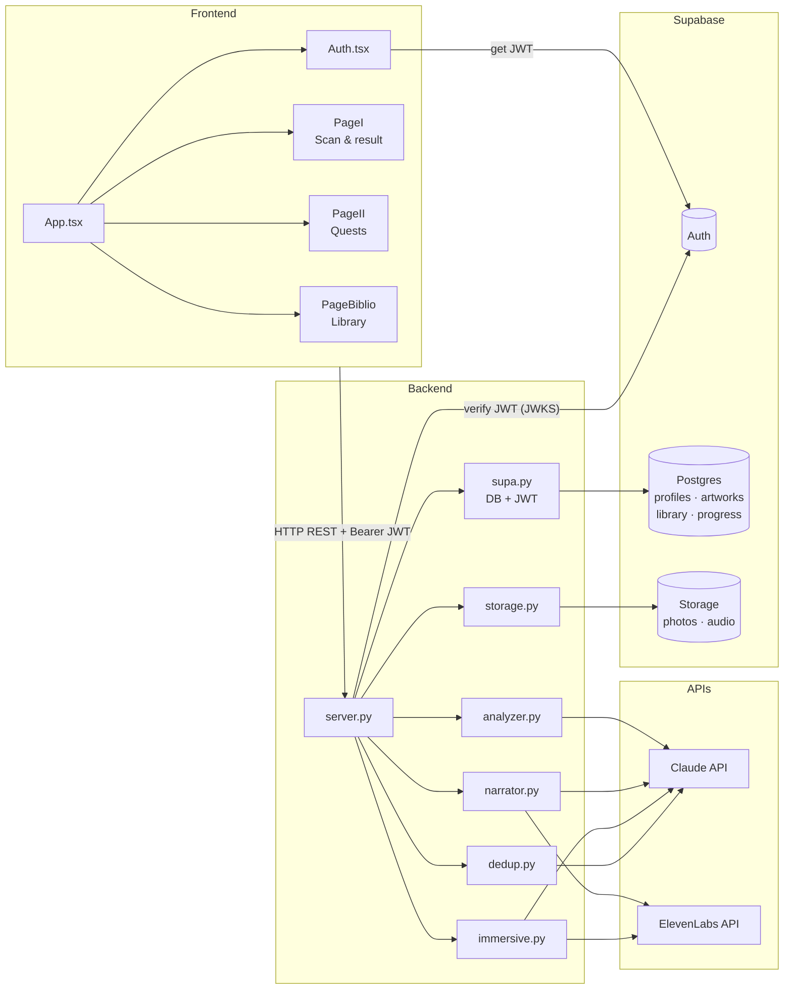

# Animart.ai 🏛️

A mobile museum guide: the visitor **photographs an artwork**, Claude analyzes it, then the app offers a **personalized audio experience** (narration or immersive scene) tailored to the visitor's profile. Includes per-artist quests and a personal library.

**Multi-user & production-ready**: authentication, data and assets run on **Supabase** (Auth + Postgres + Storage). The FastAPI backend is **stateless** (state lives in Supabase), so it scales horizontally to many concurrent visitors.

All generated content is in **English**. The JSON analysis keys remain in French (`titre_probable`, `artiste_probable`, …).

---

## How it works

UML sequence diagram — from scan to audio:



The visitor profile (questionnaire → `serious` / `fun` persona) is stored per-user in Supabase and drives the narration tone. Analyzed artworks are cached in the shared `artworks` table (+ assets in Storage); each user's library and quest progress are isolated rows protected by Row Level Security.

### Component diagram (UML)

Relationships between packages and files in the repo:



---

## Setup

```bash
uv sync                       # install Python dependencies
cd frontend && npm install    # install frontend dependencies
```

`ffmpeg` must be installed on the machine (immersive audio). Python ≥ 3.11.

### 1. Supabase project

1. Create a project at [supabase.com](https://supabase.com).
2. In **Authentication → Providers**, enable **Email** (turn email confirmation off for a quick demo, on for production). Set **Site URL** + **Redirect URLs** (`http://localhost:8000`, `http://localhost:5173`, and your prod URL).
3. Run the schema: paste [`supabase/migrations/0001_init.sql`](supabase/migrations/0001_init.sql) into the **SQL Editor** (or `supabase db push` with the CLI). It also creates the public `artwork-assets` Storage bucket.
4. Grab from **Project Settings → API**: the Project URL, the `anon` key, and the `service_role` key.

### 2. Environment

Backend — copy `.env.example` to `.env`:

```env
ANTHROPIC_API_KEY=sk-ant-...
ELEVENLABS_API_KEY=sk_...
SUPABASE_URL=https://YOUR-PROJECT.supabase.co
SUPABASE_SERVICE_ROLE_KEY=...        # secret — backend only
# SUPABASE_JWT_SECRET=...            # only if the project uses the legacy HS256 secret
```

Frontend — copy `frontend/.env.example` to `frontend/.env`:

```env
VITE_SUPABASE_URL=https://YOUR-PROJECT.supabase.co
VITE_SUPABASE_ANON_KEY=...           # public (protected by RLS)
```

### 3. (Optional) Import the existing cache

Move the previously analyzed artworks (JSON + photos + audio) into Supabase:

```bash
uv run python -m scripts.import_cache
```

---

## Run

### Dev

```bash
uv run python -m backend.server          # API on :8000 (prints a LAN URL)
cd frontend && npm run dev                # SPA on :5173 (proxies the API to :8000)
```

Or the single-server way (build then serve from FastAPI):

```bash
cd frontend && npm run build
uv run python -m backend.server           # serves the built SPA + API on :8000
```

### Production (monolith)

```bash
docker build \
  --build-arg VITE_SUPABASE_URL=$VITE_SUPABASE_URL \
  --build-arg VITE_SUPABASE_ANON_KEY=$VITE_SUPABASE_ANON_KEY \
  -t animart .
docker run -p 8000:8000 --env-file .env -e WEB_CONCURRENCY=4 animart
```

One stateless container runs gunicorn with multiple Uvicorn workers and serves the SPA. Deploy on any host (Render / Railway / Fly / Cloud Run); HTTPS is required in prod (mobile camera capture). Health check: `GET /health`.

Optional — analyze an image via CLI:

```bash
uv run python -m backend.main path/to/photo.jpg
```

---

## Files

| File / folder | Role |
|---|---|
| `backend/server.py` | FastAPI app, routes, static files (`frontend/dist`) |
| `backend/supa.py` | Supabase client, JWT verification, DB access |
| `backend/storage.py` | Supabase Storage upload + public CDN URLs |
| `backend/analyzer.py` | Claude vision → artwork JSON |
| `backend/dedup.py` | Claude agent: same artwork or new entry |
| `backend/narrator.py` | Claude script + ElevenLabs TTS |
| `backend/immersive.py` | Bridge to the immersive scene pipeline |
| `backend/matcher.py` | Artist name → museum / quest id |
| `backend/profile.py` | Questionnaire → persona |
| `frontend/src/Auth.tsx` | Email + password sign in / sign up |
| `frontend/src/PageI.tsx` | Home, scan, audio result |
| `frontend/src/PageII.tsx` | Quests (Louvre, Orsay, Pompidou) |
| `frontend/src/PageBiblio.tsx` | Personal library |
| `immersive_scene/` | Multi-voice immersive audio pipeline |
| `supabase/migrations/0001_init.sql` | DB schema + RLS + Storage bucket |
| `scripts/import_cache.py` | Import `analyses/` cache into Supabase |
| `docs/prompt.md` · `docs/narration_prompt.md` | Vision / narration prompts |

---

## API Routes

All routes (except `/health` and the asset redirects) require `Authorization: Bearer <JWT>`.

| Method | Route | Description |
|---|---|---|
| `GET` | `/health` | Liveness probe |
| `GET` | `/me` | Active profile (name, persona, journey, progress, library count) |
| `POST` | `/profile` | Create / update the profile (questionnaire) |
| `POST` | `/journey` | Save the planned visit |
| `POST` | `/analyze` | Photo → artwork JSON (+ caches, advances library/progress) |
| `POST` | `/narrate` | Narration → `{ audio_url }` (CDN) |
| `POST` | `/immersive` | Immersive scene → `{ audio_url, captions }` |
| `GET` | `/library` | The user's library |
| `GET` | `/artwork/{key}` | Full artwork JSON |
| `GET` | `/photos/{key}` · `/audio/{key}` · `/immersive-audio/{key}` | 307 redirect to the Storage CDN |

---

## Notes

- **Auth & isolation**: every user signs in; each user's library, progress and profile are isolated by Postgres Row Level Security. The shared `artworks` table caches analyses + audio across users (cost saving).
- **Scalability**: the backend is stateless → run several workers/replicas. Assets are served straight from the Storage CDN (never streamed through Python). A per-user daily scan cap (`MAX_SCANS_PER_DAY`) and an immersive concurrency limit (`MAX_CONCURRENT_IMMERSIVE`) guard cost and CPU.
- Each scan may trigger an extra Claude dedup call if the cache is non-empty.
- Narration and immersive are **two distinct modes** — the visitor picks one per artwork.
