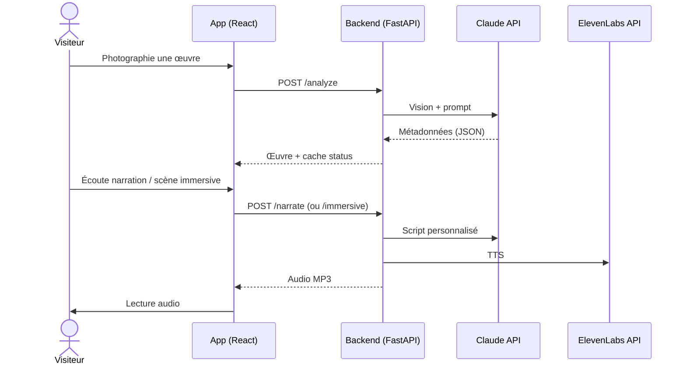
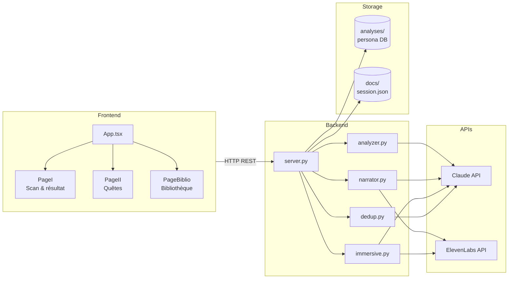

# Animart.ai 🏛️

Guide de musée mobile : l'utilisateur **photographie une œuvre**, Claude l'analyse, puis l'app propose une **visite audio personnalisée** (narration ou scène immersive) adaptée au profil du visiteur. Quêtes par artiste et bibliothèque de session incluses.

Contenu généré en **anglais**. Les clés JSON d'analyse restent en français (`titre_probable`, `artiste_probable`, …).

---

## Comment ça marche

Diagramme de séquence UML — du scan à l'audio :



Le profil visiteur (questionnaire → persona `serious` / `fun`) est stocké dans `docs/long_term_memory.md` et pilote le ton de la narration. Les œuvres scannées sont mises en cache dans `analyses/{persona}/` ; la session courante vit dans `docs/session.json`.

### Diagramme de composants (UML)

Relations entre packages et fichiers du dépôt :



---

## Setup

```bash
uv sync                       # installe les deps Python
cd frontend && npm install    # deps frontend
```

Crée un `.env` à la racine :

```env
ANTHROPIC_API_KEY=sk-ant-...
ELEVENLABS_API_KEY=sk_...
```

`ffmpeg` doit être installé sur la machine (audio immersif). Python ≥ 3.11.

---

## Lancer

```bash
cd frontend && npm run build   # une fois, ou après chaque modif UI
cd ..
uv run python -m backend.server
```

Le serveur écoute sur le **port 8000** et affiche une URL LAN pour le téléphone (même Wi‑Fi).

Optionnel — analyser une image en CLI :

```bash
uv run python -m backend.main chemin/vers/photo.jpg
```

Optionnel — synchroniser le catalogue de voix ElevenLabs :

```bash
uv run python -m immersive_scene.sync_voices
```

---

## Fichiers

| Fichier / dossier | Rôle |
|---|---|
| `backend/server.py` | API FastAPI, routes, fichiers statiques (`frontend/dist`) |
| `backend/analyzer.py` | Claude vision → JSON œuvre |
| `backend/dedup.py` | Agent Claude : même œuvre ou nouvelle entrée |
| `backend/narrator.py` | Script Claude + TTS ElevenLabs |
| `backend/immersive.py` | Pont vers la scène immersive |
| `backend/matcher.py` | Nom d'artiste → id musée / quête |
| `backend/profile.py` | Questionnaire → persona |
| `frontend/src/PageI.tsx` | Onboarding, scan, résultat audio |
| `frontend/src/PageII.tsx` | Quêtes (Louvre, Orsay, Pompidou) |
| `frontend/src/PageBiblio.tsx` | Bibliothèque de la session |
| `immersive_scene/` | Pipeline audio immersif multi-voix |
| `analyses/{serious,fun}/` | Cache partagé par persona (JSON, photos, audio) |
| `docs/prompt.md` | Prompt d'analyse vision |
| `docs/narration_prompt.md` | Prompt de narration |

---

## Routes API

| Méthode | Route | Description |
|---|---|---|
| `POST` | `/profile` | Enregistre le profil visiteur |
| `POST` | `/new-profile` | Reset session (cache persona intact) |
| `POST` | `/analyze` | Photo → JSON œuvre |
| `POST` | `/narrate` | Narration MP3 |
| `POST` | `/immersive` | Scène immersive MP3 + sous-titres |
| `GET` | `/library` | Bibliothèque session |
| `GET` | `/artwork/{key}` | JSON complet d'une œuvre |
| `GET` | `/photos/{key}` · `/audio/{key}` · `/immersive-audio/{key}` | Médias |

---

## À savoir

- Seul `/new-profile` efface la session ; le cache `analyses/` persiste.
- Chaque scan peut déclencher un appel Claude de dédup si le cache n'est pas vide.
- Narration et immersif sont **deux modes distincts** — le visiteur en choisit un par œuvre.
